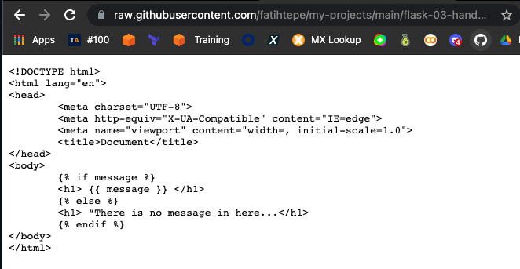
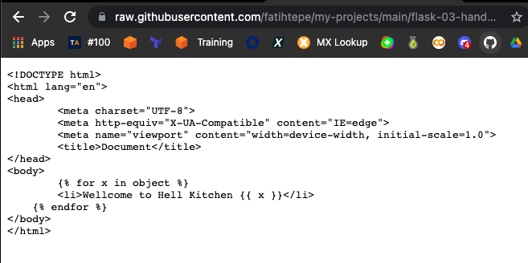
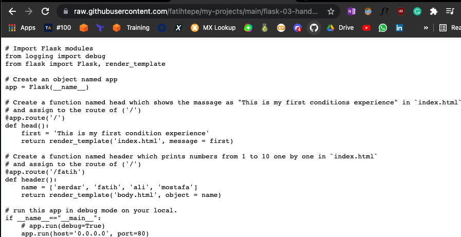
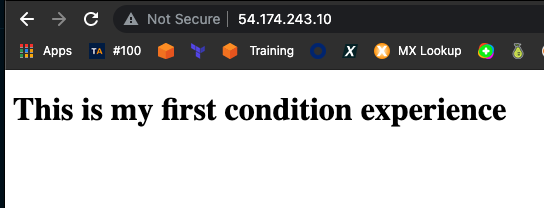
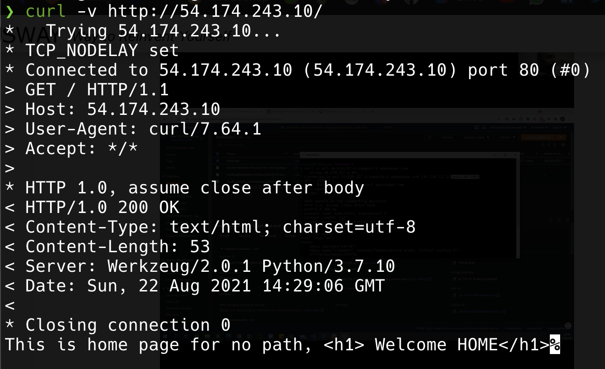
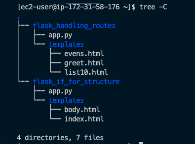

## Part 4 - Install Python and Flask framework Amazon Linux 2 EC2 Instance and Run the Hello World App on EC2 Instance

- Launch an Amazon EC2 instance using the Amazon Linux 2 AMI with security group allowing SSH (Port 22) and HTTP (Port 80) connections.

- Connect to your instance with SSH.

- Update the installed packages and package cache on your instance.

- Install `Python 3` packages.

- Check the python3 version

- Install `Python 3 Flask` framework.

- Check the versions of Flask framework packages (flask, click, itsdangerous, jinja2, markupSafe, werkzeug)

- Download the web application file from GitHub repo.

- Run the web application

- Connect the route handling and templating web application from the web browser and try every routes configured

- Open the static file `mytext.txt` context from the web browser

- Connect the route handling and templating web application from the terminal with `curl` command.

```
    1  sudo yum update -y
    2  sudo yum install python3 -y
    3  sudo pip3 install flask -y
    4  sudo pip3 install flask
    5  pip3 list
    6  mkdir flask_handling_routes flask_if_for_structure
    7  ls
    8  cd flask_if_for_structure/
    9  mkdir templates
   10  cd templates
   11  wget https://raw.githubusercontent.com/fatihtepe/my-projects/main/flask-03-handling-routes-and-if-for/Flask_if_for_structure/templates/index.html
   12  wget https://raw.githubusercontent.com/fatihtepe/my-projects/main/flask-03-handling-routes-and-if-for/Flask_if_for_structure/templates/body.html
```



```
   13  cd ..
   14  wget https://raw.githubusercontent.com/fatihtepe/my-projects/main/flask-03-handling-routes-and-if-for/Flask_if_for_structure/app.py
   ```


   ```
   15  ls
   16  sudo python3 app.py
   ```

   ```
   17  ls
   18  cd ..
   19  ls
   20  cd flask_handling_routes/
   21  ls
   22  mkdir templates
   23  cd templates/
   24  wget https://raw.githubusercontent.com/fatihtepe/my-projects/main/flask-03-handling-routes-and-if-for/flask_handling_routes/templates/evens.html
   25  wget https://raw.githubusercontent.com/fatihtepe/my-projects/main/flask-03-handling-routes-and-if-for/flask_handling_routes/templates/greet.html
   26  wget https://raw.githubusercontent.com/fatihtepe/my-projects/main/flask-03-handling-routes-and-if-for/flask_handling_routes/templates/list10.html
   27  cd ..
   28  wget https://raw.githubusercontent.com/fatihtepe/my-projects/main/flask-03-handling-routes-and-if-for/flask_handling_routes/app.py
   29  ls
   30  sudo python3 app.py
   31  cd ..
   32  ls

```


- curl


- project Skeleton

