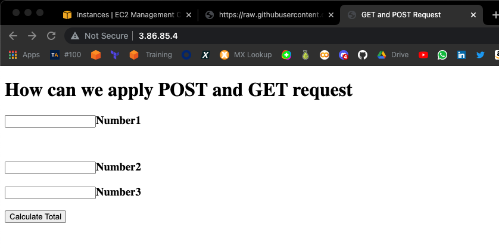
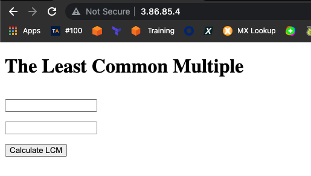
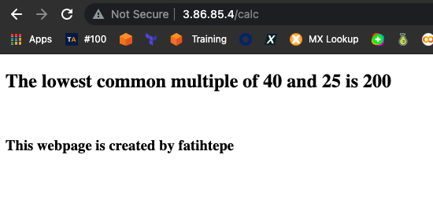
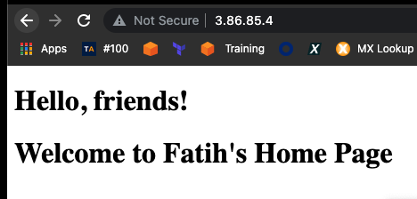

[Part 5 - Install Python and Flask framework on Amazon Linux 2 EC2 Instance](./README.md)

- Launch an Amazon EC2 instance using the Amazon Linux 2 AMI with security group allowing SSH (Port 22) and HTTP (Port 80) connections.

- Connect to your instance with SSH.

- Update the installed packages and package cache on your instance.

- Install `Python 3` packages.

- Check the python3 version

- Install `Python 3 Flask` framework.

- Check the versions of Flask framework packages

- Pull the files from github repo

- Run the Flask application

```
ssh -i aws.pem ec2-user@3.86.85.4
    1  clear
    2  sudo yum update -y
    3  python3 --version
    4  sudo pip3 install flask
    5  mkdir Flask_GET_POST_Methods_1
    6  mkdir Flask_GET_POST_Methods_2
    7  mkdir flask-04-handling-forms
    8  cd Flask_GET_POST_Methods_1
    9  mkdir templates
   10  cd templates/
   11  wget https://raw.githubusercontent.com/fatihtepe/my-projects/main/flask-04-handling-forms-POST-GET-Methods/Flask_GET_POST_Methods_1%20/templates/index.html
   12  wget https://raw.githubusercontent.com/fatihtepe/my-projects/main/flask-04-handling-forms-POST-GET-Methods/Flask_GET_POST_Methods_1%20/templates/number.html
   13  cd ..
   14  wget https://raw.githubusercontent.com/fatihtepe/my-projects/main/flask-04-handling-forms-POST-GET-Methods/Flask_GET_POST_Methods_1%20/app.py
   15  sudo python3 app.py
```

   

```
   16  cd ..
   17  ls
   18  cd Flask_GET_POST_Methods_2
   19  ls
   20  mkdir templates
   21  cd templates/
   22  wget https://raw.githubusercontent.com/fatihtepe/my-projects/main/flask-04-handling-forms-POST-GET-Methods/Flask_GET_POST_Methods_2/templates/index.html
   23  wget https://raw.githubusercontent.com/fatihtepe/my-projects/main/flask-04-handling-forms-POST-GET-Methods/Flask_GET_POST_Methods_2/templates/result.html
   24  cd ..
   25  wget https://raw.githubusercontent.com/fatihtepe/my-projects/main/flask-04-handling-forms-POST-GET-Methods/Flask_GET_POST_Methods_2/app.py
   26  sudo python3 app.py
```
   

   

```
   27  cd ..
   28  ls
   29  cd flask-04-handling-forms/
   30  ls
   31  mkdir templates
   32  cd templates/
   33  wget https://raw.githubusercontent.com/fatihtepe/my-projects/main/flask-04-handling-forms-POST-GET-Methods/flask-04-handling-forms/templates/greet.html
   34  wget https://raw.githubusercontent.com/fatihtepe/my-projects/main/flask-04-handling-forms-POST-GET-Methods/flask-04-handling-forms/templates/login.html
   35  wget https://raw.githubusercontent.com/fatihtepe/my-projects/main/flask-04-handling-forms-POST-GET-Methods/flask-04-handling-forms/templates/main.html
   36  wget https://raw.githubusercontent.com/fatihtepe/my-projects/main/flask-04-handling-forms-POST-GET-Methods/flask-04-handling-forms/templates/secure.html
   37  cd ..
   38  wget https://raw.githubusercontent.com/fatihtepe/my-projects/main/flask-04-handling-forms-POST-GET-Methods/flask-04-handling-forms/form-handling.py
   39  ls
   40  sudo python3 form-handling.py
```


