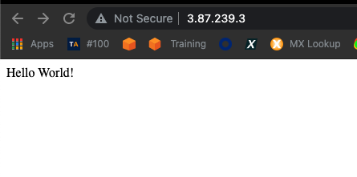
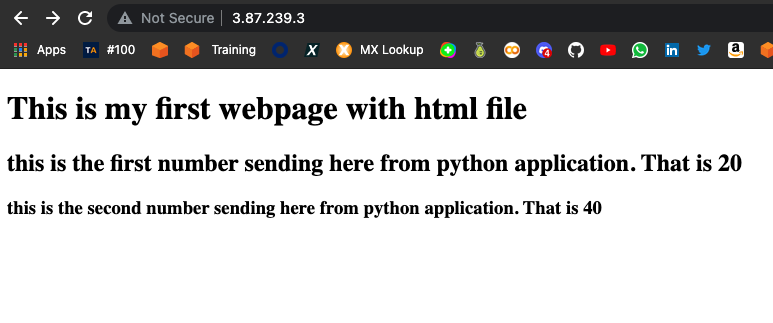

## Part 4 - Run the Hello World App on EC2 Instance

- Launch an Amazon EC2 instance using the Amazon Linux 2 AMI with security group allowing SSH (Port 22) and HTTP (Port 80) connections.

- Connect to your instance with SSH.

- Update the installed packages and package cache on your instance.

- install git and wget

- Download the web application file from GitHub repo.

- Run the web application

- Connect the Hello World application from the web browser

```
  1  sudo yum update -y
    2  sudo yum install python3 -y
    3  python3 --version
    4  sudo pip3 install flask
    5  pip3 list
    6  sudo yum install git wget
    7  wget https://raw.githubusercontent.com/fatihtepe/my-projects/main/flask-01-02-hello-world-app-Jinja-Template/flask-01-hello-world-app/hello-world-app.py
    8  ls
    9  sudo python3 hello-world-app.py
```


```
   10  mkdir templates
   11  cd templates/
   12  wget https://raw.githubusercontent.com/fatihtepe/my-projects/main/flask-01-02-hello-world-app-Jinja-Template/flask-02-Jinja_Template/templates/body.html
   13  wget https://raw.githubusercontent.com/fatihtepe/my-projects/main/flask-01-02-hello-world-app-Jinja-Template/flask-02-Jinja_Template/templates/index.html
   14  ls
   15  cd ..
   16  wget https://raw.githubusercontent.com/fatihtepe/my-projects/main/flask-01-02-hello-world-app-Jinja-Template/flask-02-Jinja_Template/jinja.py
   17  sudo python3 jinja.py
   18  history > project12.txt
```
