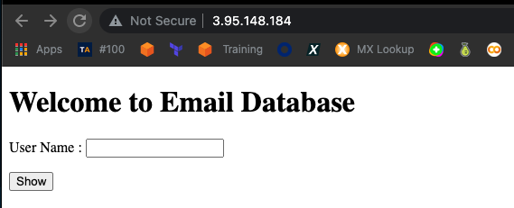
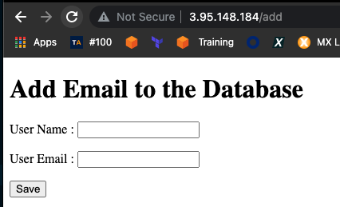

## [Part 3 - Install Python and Flask framework on Amazon Linux 2 EC2 Instance](./README.md)

- Launch an Amazon EC2 instance using the Amazon Linux 2 AMI with security group allowing SSH (Port 22) and HTTP (Port 80) connections.

- Connect to your instance with SSH.

- Update the installed packages and package cache on your instance.

- Install `Python 3` packages.

- Check the python3 version

- Install `Python 3 Flask` framework.

- Install `flask_mysql`.

- Run application with Python

```
ssh -i aws.pem ec2-user@3.95.148.184
   1  sudo python3 app-with-mysql.py
   2  sudo python3 install pip3
   3  sudo pip3 install flask
   4  cd ..
   5  sudo pip3 install flask
   6  sudo pip3 install flask-mysql
   7  sudo pip3 install sqlalchemy
   8  sudo pip3 install flask-SQLAlchemy
   9  ls
   10  cd flask-05-Handling-SQL-with-Flask-Web-Application/
   11  ls
   12  sudo python3 app-with-mysql.py
```


